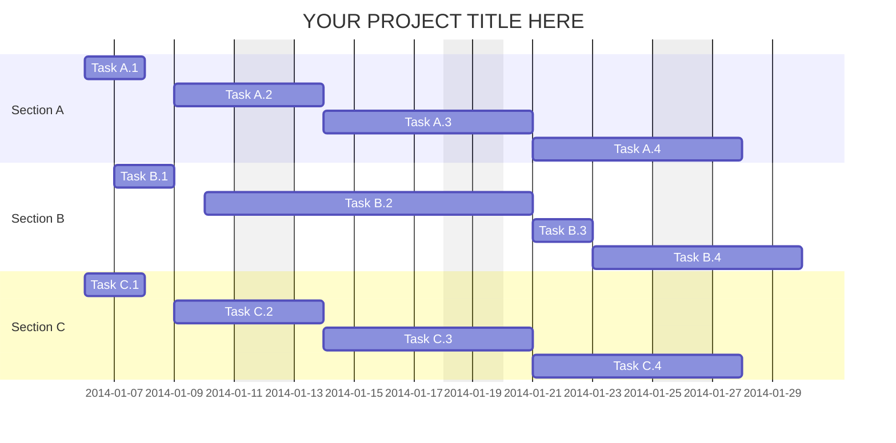
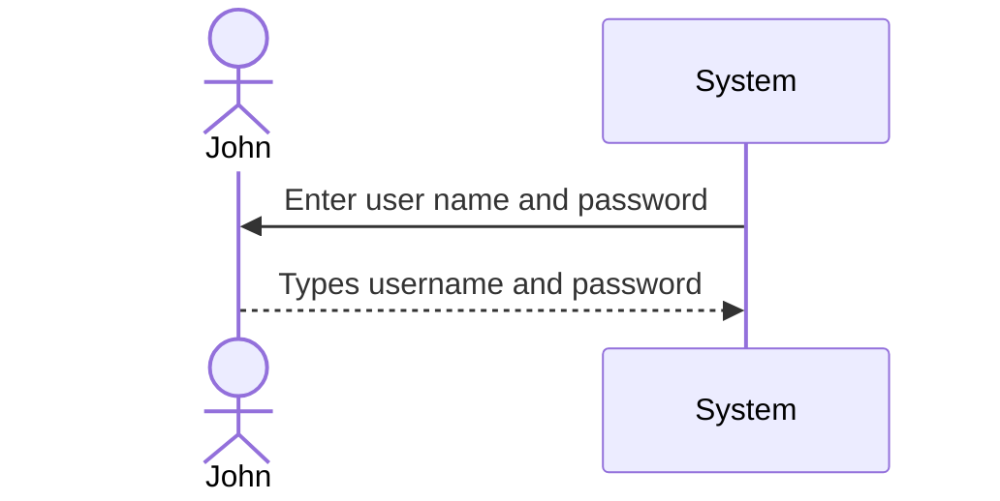

# System Request Document

## Table of Content

1. System Request
2. Work Plan
3. Feasibility Analysis
   1. Technical Feasibility
   2. Organizational Feasibility
4. Requirements Definition
   1. Functional Requirement
   2. Non-functional Requirement
5. Logical Design
   1. Sequence Diagram
   2. Use Cases
   3. Process Modeling (Data Flow Diagram)
      1. Level 0 Diagram
      2. Level 1 Diagram
      3. Level 2 Diagram
      4. Level 3 Diagram
      5. Level 4 Diagram
      6. Level 5 Diagram
   4. Data Modeling (Entity Relationship Diagram)
   5. Structure Chart Diagram
6. Appendices

## Executive Summary
> A summary of all the essential information in the proposal so that a busy executive can read it quickly and decide what parts of the plan to read in more depth.

## 1. System Request

> *Reference Chapter 1*

**Project Sponsor:** Carmella Herrera, General Manager, Client Services Business Unit

**Business Need:** This project has been initiated . . .

**Business Requirements:** Using this system from our . . .

**Business Value:** The Client Services business unit . . .

**Special Issues or Constraints:** The capabilities described . . .

## 2. Work plan
> The original work plan revised after having completed the analysis phase.
### Gantt Chart

## 3. Feasibility Analysis
> *Reference Chapter 1*

> A revised feasibility analysis, using the information from the analysis phase.

### 3.1 Technical Feasibility

### 3.2 Organizational Feasibility

## 4. Requirements Definition
> *Reference Chapter 3*

> A list of the functional and nonfunctional business requirements for the system.

### 4.1 Functional Requirements:

### 4.2 Nonfunctional Requirements:

1. **Operational**

2. **Performance**

3. **Security**

4. **Cultural and political**

## 5. Logical Design

> A set of use cases that illustrate the basic processes that the system needs to support.

### 5.1 Sequence Diagram

### 5.2 Use Cases
> *Reference Chapter 4*

#### Use Case Name:  Your use case name

> __ID__ :

> __Priority__ :

> __Actor__ :

> __Description__ :

> __Trigger__ :

> __Type__ :

> __Preconditions__ :
>   1. Condition 1
>   2. Condition 2
>   3. ......

| Normal Course: | Information for Steps |
|---|---|
|1.0 Finalize Parts Request||
|1. Parts room clerk opens the parts . . . | <--- Parts Request record  |
|2. Parts room clerk verifies . . . |<--- Shop Work Order Record|

> __Postconditions__ :
>   1. Condition 1
>   2. Condition 2
>   3. ......

|Summary Inputs|Source|Summary Outputs| Destination|
|---|---|---|---|
|Final parts verification|Parts room clerk|Parts request record|Parts room clerk|
|Date/time completion|Parts room clerk|Shop work order record|Shop work order datastore|
|||Work Order ready notice|Technician|
 
### 5.3 Process Model (Data Flow Diagram)
> A set of process models and descriptions for the to‐be system. This may include process models of the current as‐is system that will be replaced.

### 5.4 Data Model (Entity Relationship Diagram)
> *Reference Chapter 5*

> A set of data models and descriptions for the to‐be system. This may include data models of the as‐is system that will be replaced.

### 5.4 Structure Chart Diagram
> *Reference Chapter 9*

## 6. Appendices
> These contain additional material relevant to the proposal, often used to support the recommended system. This might include results of a questionnaire survey or interviews, industry reports and statistics, etc.
